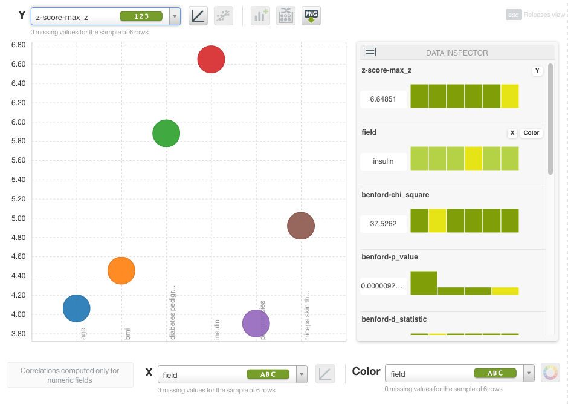

# Statistical Tests

Although BigML offers Statistical Tests through its
[API](https://bigml.com/api/statisticaltests), they are not offered
in the **Dashboard**.

In this package you'll find a script that obtains all the statistical
tests for a given dataset and creates a report dataset with the
results. It also returns a map with aggregated metrics across all the
numeric fields.

One interesting thing to do with the output dataset is using the
**Scatter Plot** view to visualize the metrics for all the fields in
your original dataset.




The **inputs** for the script are:

* `dataset-id`: (dataset-id) Dataset ID to analyze
* `add-sample-size`: (integer) The number of samples to be used during
  the normality test. **Default**: 1024
* `ad-seed:` (string) A string to be hashed to generate deterministic
  samples for the Anderson-Darling normality test. **Default**: bigml

The **outputs** for the script are:
* `output`: (map) Full statistical tests output
* `benford`: (map) Benford test results
* `anderson`: (map) Anderson-Darling test results
* `jarque-bera`: (map) Jarque-Bera tests results
* `z-score`: (map) Z-score test results
* `grubbs`: (map) Grubbs tests results
* `summary`: (map) Summary results aggregating metrics from all
  numeric fields
* `tests-results-dataset`: (map) Dataset with the results of the tests
  for each field

You can find more information about these tests
[here](https://bigml.com/api/statisticaltests).


## Tests

The `test` directory contains a shell script named `test.sh`
which uses `BigMLer` to perform a basic test of the WhizzML code. To run the
test:

- BigMLer must be installed. For instructions to install BigMLer
please refer to the [BigMLer
documentation](http://bigmler.readthedocs.io/en/latest/#bigmler-installation).
- Your credentials must be set as environment variables. Please refer
to the [BigML
Authentication](http://bigmler.readthedocs.io/en/latest/#bigml-authentication)
section of docs for details.

Once the setup is complete, go to the test directory and run the shell script

```bash
    cd test
    ./test.sh
```
